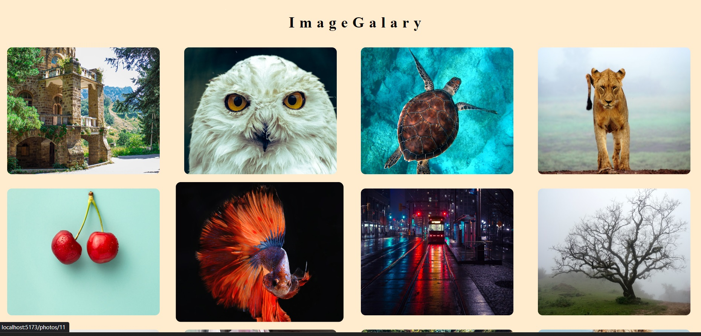
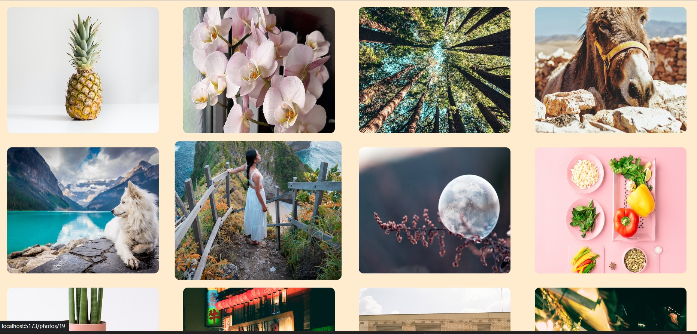
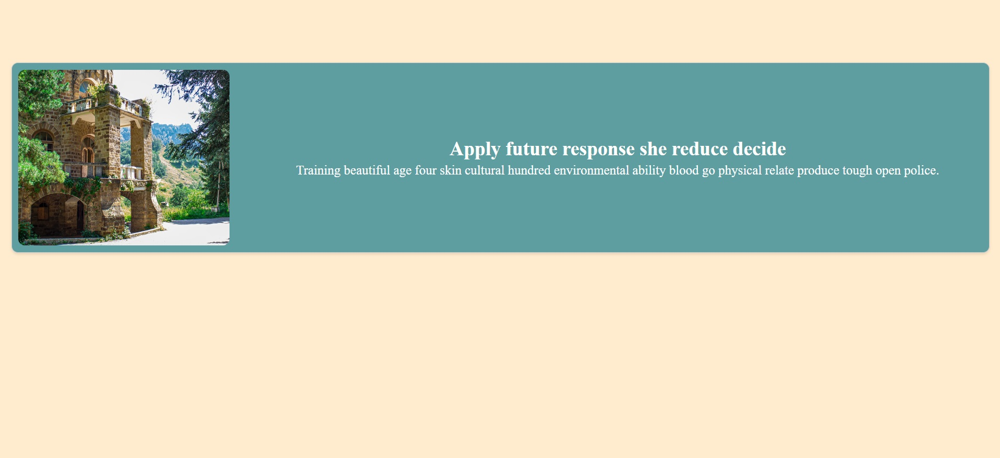

# React-ImageGalary

Welcome to the README for React ImageGallery, a simple image gallery built using React. Follow the instructions below to set up and run the image gallery on your local machine.

## Prerequisites
Before you begin, ensure you have the following software installed on your machine:

- **Operating System:** Windows, macOS, or Linux
- **Node.js:** Version 14.x or later
- **npm:** Package manager for Node.js (usually comes with Node.js)

## Installation
  1. **Clone the Repository:**

 Clone this repository to your local machine using the following command:
   ```bash
   git clone https://github.com/kri-sh27/React-ImageGalary.git
```
 2. **Navigate to the Project Directory:**
Change your working directory to the project folder:
```bash
cd ImageGalery
```
3. **Install Dependencies:**
Use npm to install the required dependencies:
```bash
npm install
 ```
# Running the Application
Now that you have set up everything, it's time to run the imagegalery:
1. **Start the Application:**
Run the following command to start the development server:
```bash
npm run dev
```
2. **Access the Image Gallery:**
Once the development server is up and running, you can access the image gallery by opening your web browser and navigating to:
```bash
http://localhost:5173
```
# Stopping the Application
To stop the development server, go to the terminal where the server is running and press `Ctrl + C`. This will gracefully shut down the server.


#SCREENSHOTS
<h1 [align]="center">ScreenShot</h1><hr>
    
    
    
    
    <hr>


   

